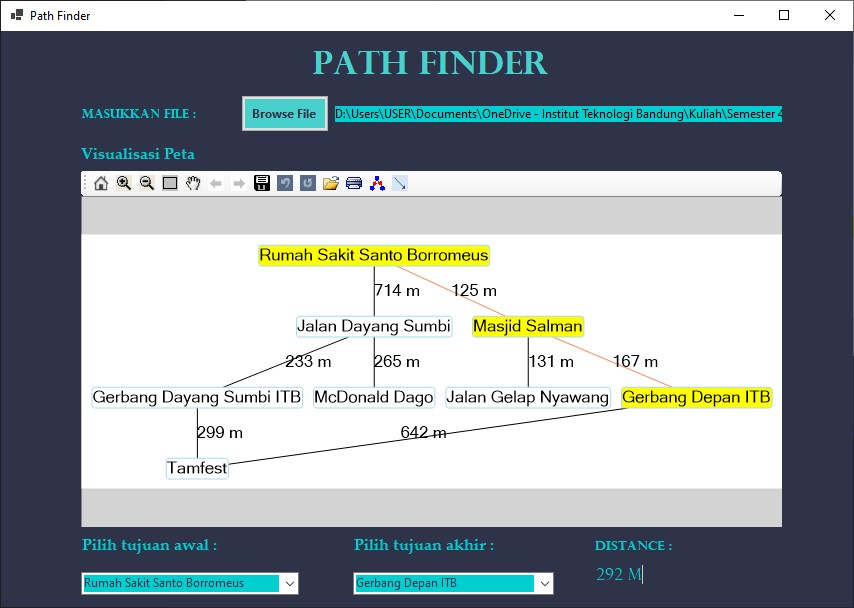

# Shortest Path Finder
> Program ini adalah program untuk menentukan lintasan terpendek antara dua simpul pada sebuah graf berbobot dengan menggunakan algoritma A*.

## Table of contents
* [General info](#general-info)
* [Screenshots](#screenshots)
* [Technologies](#technologies)
* [Setup](#setup)
* [Contact](#contact)

## General info
Program ini dibuat untuk memenuhi Tugas Kecil 3 IF2211 Strategi Algoritma Program Studi Informatika ITB.

## Screenshots


## Technologies
* C#

## Setup
1. Jalankan program `PathFinder.exe` yang terdapat di folder bin.
2. Ketik tombol `Browse file` untuk mengunggah file graf.  

   File graf memiliki format sebagai berikut:
   ```
   <jumlah simpul n>
   <koordinat garis lintang> <koordinat garis bujur> <nama simpul> (sebanyak n baris)
   <matriks ketetanggaan nxn>
   ```
   
   Contoh:
   ```
   8
   -6.893216157348017 107.61043379205204 Gerbang Depan ITB
   -6.893791326286216 107.6130140769148 Rumah Sakit Santo Borromeus
   -6.887389869593723 107.61353978992962 Jalan Dayang Sumbi
   -6.885003946847328 107.61362562064774 McDonald Dago
   -6.8873792181747495 107.61143157379732 Gerbang Dayang Sumbi ITB
   -6.887693434797744 107.6087386360365 Tamfest
   -6.893588952101085 107.61189693708492 Masjid Salman
   -6.894749939631782 107.61168906590126 Jalan Gelap Nyawang
   0 0 0 0 0 1 1 0
   0 0 1 0 0 0 1 0
   0 1 0 1 1 0 0 0
   0 0 1 0 0 0 0 0
   0 0 1 0 0 1 0 0
   1 0 0 0 1 0 0 0
   1 1 0 0 0 0 0 1
   0 0 0 0 0 0 1 0
   ```
4. Pilih simpul asal dan simpul tujuan
5. Program akan menampilkan lintasan terpendek dan jarak yang harus ditempuh

## Status
Project is: _finished_

## Contact
Created by  
[13519181 - Nabilah Erfariani](https://github.com/nabilaherfar)  
[13519192 - Gayuh Tri Rahutami](https://github.com/wundersmith)
